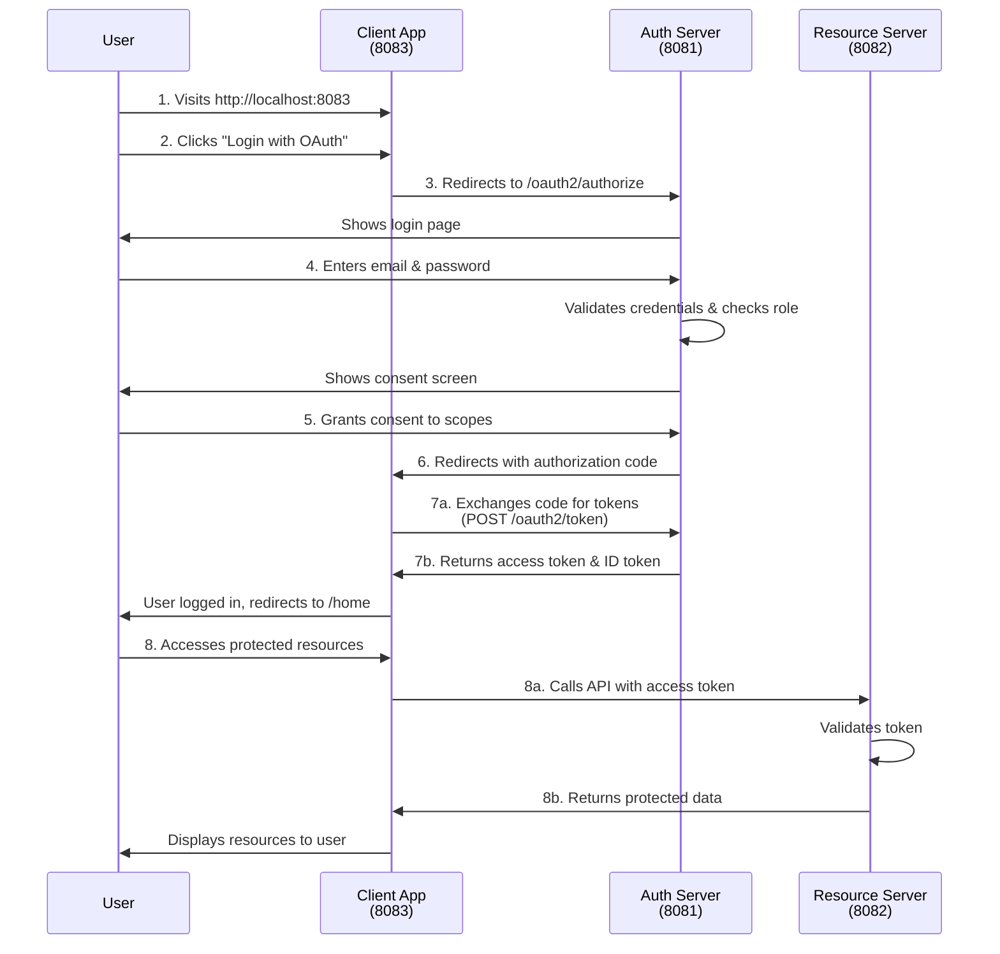

# OAuth2 Authorization Server

A Spring Boot-based OAuth2 Authorization Server that handles user authentication and token generation for OAuth2 clients using OpenID Connect protocol.

## Project Overview

This project implements a complete OAuth2 Authorization Server using Spring Authorization Server. It manages user authentication, OAuth2 token generation, and provides OpenID Connect support. The server validates user credentials with email and password, issues JWT access tokens and refresh tokens, and supports role-based access control (USER/ADMIN).

## Features

- **User Authentication**: Secure user login with email and password
- **OAuth2 Authorization Code Flow**: Standard OAuth2 authorization code grant type
- **OpenID Connect Support**: Full OIDC implementation with user information endpoints
- **JWT Tokens**: Issues and manages JWT access tokens and refresh tokens
- **JWKS Endpoint**: Provides public keys for token verification
- **Role-Based Access Control**: Users can have roles (USER or ADMIN)
- **In-Memory Database**: H2 database for fast development and testing

## Tech Stack

- **Framework**: Spring Boot 3.x
- **Security**: Spring Security 6.x
- **Authorization Server**: Spring OAuth2 Authorization Server
- **Database**: H2 (In-Memory Database)
- **Authentication**: JWT (JSON Web Tokens)
- **Build Tool**: Maven
- **Language**: Java 17+
- **Utilities**: Lombok

## OAuth2 Login Flow



## Database Schema

The application uses a single `users` table to store user information:

### Table Columns

| Column | Type | Description |
|--------|------|-------------|
| `id` | BIGINT | Primary key, auto-incremented |
| `username` | VARCHAR(100) | Display name for the user |
| `email` | VARCHAR(100) | Unique email for login |
| `password` | VARCHAR(255) | Encrypted password |
| `role` | VARCHAR(50) | User role: `USER` or `ADMIN` |

## Installation

### Prerequisites

- Java 17 or higher
- Maven 3.8+
- Git

### Step 1: Clone the Repository

```bash
git clone <repository-url>
cd auth-server
```

### Step 2: Open the Project

Open the project in your IDE (IntelliJ IDEA, Eclipse, or VS Code with Java extensions).

### Step 3: Configure application.yml

Create or update `src/main/resources/application.yml`:

```yaml
server:
  port: 8081
  address: 127.0.0.1

spring:
  security:
    oauth2:
      authorizationserver:
        issuer: http://127.0.0.1:8081

  datasource:
    driver-class-name: org.h2.Driver
    url: jdbc:h2:mem:demo_db
    username: root
    password:
  database-platform: org.hibernate.dialect.H2Dialect

  h2:
    console:
      enabled: true
      path: /h2-console

  jpa:
    hibernate:
      ddl-auto: update
    show-sql: true
```

### Step 4: Build the Project

```bash
mvn clean install
```

### Step 5: Run the Application

```bash
mvn spring-boot:run
```

Or:

```bash
java -jar target/auth-server-0.0.1-SNAPSHOT.jar
```

The server will start on `http://127.0.0.1:8081`

### Step 6: Verify Installation

1. **Check H2 Console** (Optional): http://127.0.0.1:8081/h2-console
    - JDBC URL: `jdbc:h2:mem:testdb`
    - Username: `sa`
    - Password: (leave empty)

2. **Test JWKS Endpoint**: http://127.0.0.1:8081/.well-known/jwks.json


## OAuth2 Endpoints

### Authentication Endpoints

- **Login Page**: `GET /login`
- **OAuth2 Authorization**: `GET /oauth2/authorize`
- **Token Endpoint**: `POST /oauth2/token`
- **User Info**: `GET /userinfo`
- **JWKS**: `GET /.well-known/jwks.json`
- **Logout**: `GET /logout`

### Regular Endpoints - Using Postman
- **Create user/admin**: `POST /users`


## User Roles

The application supports two user roles:

- **USER**: Can view resources (read-only access)
- **ADMIN**: Can view, create, update, and delete resources (full access)

Roles are included in the JWT token and can be verified by resource servers.

## Related Projects

- **Resource Server** (Port 8082): Protects APIs with OAuth2 tokens
- **Client Application** (Port 8083): OAuth2 client web app

